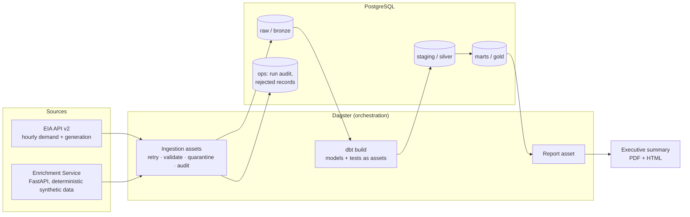

# Energy Analytics Pipeline

An end-to-end local data platform that ingests hourly electricity demand and
generation data from the [EIA API](https://www.eia.gov/opendata/), enriches it
with reference data and demand forecasts from a purpose-built FastAPI service,
transforms it through a medallion-style dbt project in PostgreSQL, and produces
a PDF executive summary on grid demand, fuel mix, emissions, forecast accuracy,
and demand anomalies — all orchestrated by Dagster.

Built for the Dakota Analytics technical assessment.

## Architecture



The full asset lineage (source APIs → raw tables → dbt models → report) is
browsable in the Dagster UI at http://localhost:3000 after a run.

## Quick start

Prerequisites: Docker (with Compose) and [uv](https://docs.astral.sh/uv/)
(only needed for `make test`). Verified on macOS; Linux should work as-is;
Windows users can use `run.bat`.

```bash
make setup     # creates .env, builds images
make run       # starts services, executes the full pipeline, writes the PDF
```

That's it. `make run` finishes by printing the report location. First run
ingests 30 days of history (~2–4 minutes); subsequent runs are incremental
and much faster.

An EIA API key is **recommended but not required**:

- **With a key** (free, instant: https://www.eia.gov/opendata/register.php):
  put it in `.env` as `EIA_API_KEY=...` before `make run`. The pipeline uses
  real ERCOT / CAISO / MISO grid data.
- **Without a key**: the pipeline runs in demo mode with deterministic
  synthetic data shaped like the real feed. The report is clearly
  watermarked. Every feature works identically.

## What to look at after `make run`

| Where | What you'll see |
|---|---|
| `reports/output/executive_summary_<date>.pdf` | The business deliverable: KPIs, trends, fuel mix, anomalies, forecast accuracy |
| http://localhost:3000 | Dagster UI: asset lineage graph, data-quality check results, per-run row counts and windows |
| http://localhost:8001/docs | Enrichment service OpenAPI docs (try the endpoints live) |
| `make psql` → `select * from ops.pipeline_runs order by finished_at desc;` | Run-level audit trail |
| `make dbt-docs` → http://localhost:8080 | dbt docs: interactive lineage from raw sources to the PDF exposure |
| `docs/` | Architecture, data model, operations, and reporting documentation |

## Commands

| Command | Purpose |
|---|---|
| `make setup` | One-time: create `.env`, build images |
| `make run` | Start services and execute the full pipeline end-to-end (safe to re-run; loads are idempotent) |
| `make test` | Unit tests — no Docker, database, network, or API key required |
| `make report` | Regenerate the PDF and dbt docs from current warehouse state |
| `make clean` | Remove containers, volumes, and generated outputs |
| `make logs` / `make psql` / `make dbt-docs` | Conveniences: tail orchestrator logs, open a SQL shell, serve dbt docs on :8080 |

`run.sh` / `run.bat` wrap `setup` + `run` for one-command evaluation.

## Environment variables

All configuration is environment-driven; `.env.example` documents every
variable. The ones you might change:

| Variable | Default | Meaning |
|---|---|---|
| `EIA_API_KEY` | *(blank → demo mode)* | EIA Open Data API key |
| `EIA_RESPONDENTS` | `ERCO,CISO,MISO` | Balancing authorities to ingest |
| `BACKFILL_DAYS` | `30` | History fetched on first run |
| `INCREMENTAL_LOOKBACK_HOURS` | `72` | Re-fetch window on later runs (absorbs EIA revisions) |

## How to test

```bash
make test
```

19 unit tests cover the enrichment API contract (including forecast
determinism), EIA client validation/quarantine routing, pagination, retry
policy (retries 429/5xx, fails fast on 4xx), the ingestion asset lifecycle
with all I/O faked, incremental window logic, and report insight/template
rendering. Integration coverage is the pipeline itself: `dbt build` runs 29
data tests on every execution, and Dagster asset checks gate the raw layer.

## Troubleshooting

- **Port already in use (5432/3000/8001):** stop the conflicting service or
  edit the port mappings in `docker-compose.yml`.
- **`dagster` container unhealthy:** `make logs`. The most common cause is a
  dbt manifest build failure, which surfaces in the image build output.
- **EIA returns 403:** the key in `.env` is wrong. The client fails fast on
  auth errors by design (no retries); fix the key or blank it for demo mode.
- **Report says "demo mode" unexpectedly:** `EIA_API_KEY` isn't reaching the
  container — confirm it's set in `.env` (not just your shell) and re-run.
- **WeasyPrint errors when running reports natively (not via Docker):**
  `brew install pango` (macOS). The Dagster container has these libs baked in.

## Design highlights

- **Idempotent by construction:** natural-key `UNIQUE` constraints +
  `ON CONFLICT` upserts in raw, `delete+insert` incremental dbt facts with a
  3-day lookback for late EIA revisions. Re-running anything is always safe.
- **Validation with quarantine:** records failing schema validation land in
  `ops.rejected_records` with a reason instead of failing the batch or being
  silently dropped.
- **Layered quality gates:** Pydantic at the edges → Dagster asset checks on
  raw → dbt tests interleaved with builds (`dbt build`), so marts never build
  on data that failed staging tests.
- **Observable:** every asset run writes to `ops.pipeline_runs`; row counts
  and fetch windows surface as Dagster materialization metadata; the report
  footer cites data freshness.
- **Meaningful enrichment:** the FastAPI service isn't decorative — emission
  factors turn generation into CO₂ estimates, and synthetic forecasts joined
  to real actuals enable MAPE analysis. A warn-level dbt test caught real
  fuel codes (`BAT`, `GEO`) missing from the reference set during
  development; the fix was one line in the service. See `docs/decisions.md`
  for tradeoffs.
