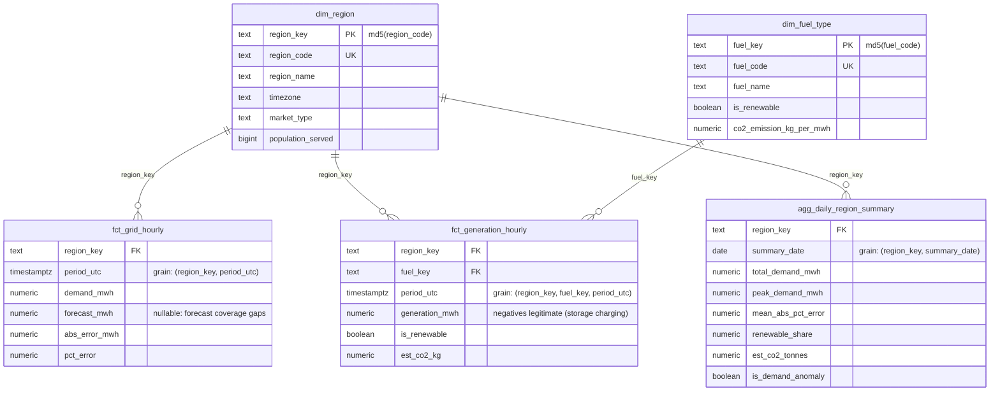

# Data model

## ER diagram

The rendered version of this diagram is [`er_diagram.png`](er_diagram.png).

The diagram shows the **gold layer** — the modeled, consumable surface. Raw
and ops tables are documented below; staging views mirror raw one-to-one.

## Layer-by-layer table reference

### `raw` (bronze) — loaded by ingestion

| Table | Grain (natural key, UNIQUE-enforced) | Notes |
|---|---|---|
| `eia_demand_hourly` | (respondent, period_utc) | Hourly demand per balancing authority. `demand_mwh` nullable — EIA publishes gaps. |
| `eia_generation_hourly` | (respondent, fuel_type, period_utc) | Hourly net generation by fuel. |
| `api_regions` | (region_code) | Region reference from enrichment service. |
| `api_fuel_types` | (fuel_code) | Renewable flag + CO₂ factor (kg/MWh). |
| `api_demand_forecast` | (region_code, period_utc, forecast_run) | `forecast_run` identifies the forecast vintage, allowing multiple vintages to coexist. |

Every raw table carries lineage columns: `_run_id`, `_ingested_at`,
`_source`, `_record_hash`. Upserts target the natural key, so re-ingestion
overwrites in place (EIA revisions are absorbed, never duplicated).

### `staging` (silver) — dbt views

One view per raw table: renames to analytics vocabulary
(`respondent → region_code`), casts, and applies fitness rules. The two
worth knowing:

- `stg_eia__demand` **excludes** null and negative demand (metering
  artifacts, not analyzable load).
- `stg_eia__generation` **keeps** negative generation — real phenomena
  (pumped-storage charging); dropping them would misstate the fuel mix.

### `marts` (gold) — dbt tables

| Model | Grain | Materialization | Purpose |
|---|---|---|---|
| `dim_region` | region | table | Region attributes from enrichment. |
| `dim_fuel_type` | fuel | table | Renewable flag, emission factor — the join that turns MWh into CO₂. |
| `fct_grid_hourly` | (region, hour) | **incremental**, delete+insert, 3-day lookback | Actual demand ⟕ forecast → error metrics. Left join: missing forecasts must not remove actuals; coverage is tested instead (≥95%). |
| `fct_generation_hourly` | (region, fuel, hour) | **incremental**, same strategy | Generation + emissions. Inner join to `dim_fuel_type` is a deliberate contract: unmapped fuel codes are surfaced by a warn-level relationships test rather than silently passing through unenriched. |
| `agg_daily_region_summary` | (region, day) | table | Report backbone: daily rollups + anomaly flag (\|daily total − 14-day rolling mean\| > 2.5σ). |

### `ops` — operational metadata

| Table | Grain | Purpose |
|---|---|---|
| `pipeline_runs` | (run_id, asset_name) | Audit: status, row counts, fetch window, timing, error message. Cited in the report footer. |
| `rejected_records` | row | Quarantine: payload + rejection reason for every record failing validation. |

## Keys and relationships

Surrogate keys are `md5(natural_key)` — deterministic, so incremental runs
and full rebuilds produce identical keys without sequence coordination.
Referential integrity is enforced by dbt `relationships` tests rather than
FK constraints: in an analytical schema rebuilt by dbt, declarative
constraints fight the rebuild order, while tests provide the same guarantee
at build time (and `dbt build` halts downstream models on failure).

## Time-series considerations

- All timestamps are **UTC** (`timestamptz`); EIA hourly periods are parsed
  as hour-beginning UTC. Local-time daily shapes are handled in the
  enrichment service's forecast generator, not in the warehouse.
- **Late-arriving data:** EIA revises recent hours. Handled twice — the
  ingestion window re-fetches a 72h lookback with upserts, and the
  incremental facts reprocess a 3-day trailing window.
- **Volume & indexing:** ~30 days × 3 regions ≈ 2.2K demand rows, ~20K
  generation rows — btree indexes on `(respondent, period_utc)` suffice.
  The scaling path (documented, not built): range partitioning on
  `period_utc`, BRIN indexes, or a columnar engine for the marts.
- The daily aggregate's rolling window intentionally excludes the current
  day (`rows between 14 preceding and 1 preceding`), so an anomalous day
  cannot suppress its own detection.
